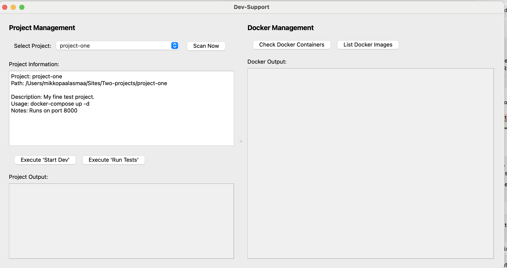

# Dev-Support MVC Implementation Code

This document contains code snippets for implementing the Dev-Support application using the MVC pattern. These code samples are organized by component and can be used as a reference during implementation.

## Table of Contents
- [Implementation Philosophy](#implementation-philosophy)
- [Current Implementation Status](#current-implementation-status)
- [Use Cases](#use-cases)
- [Project Setup](#project-setup)
- [Configuration](#configuration)
- [Utilities](#utilities)
- [Models](#models)
- [Services](#services)
- [Views](#views)
- [Application Controller](#application-controller)
- [Main Entry Point](#main-entry-point)

## Implementation Philosophy

The implementation follows these guiding principles to avoid over-engineering while maintaining a clean architecture:

### Core Principles

1. **Start Small, Grow Incrementally**
   - Begin with minimal MVC structure that works
   - Add complexity only when it provides tangible benefits
   - Resist the urge to implement theoretical "best practices" that don't address actual problems

2. **Simplicity Over Sophistication**
   - Use direct method calls between components initially
   - Avoid complex patterns (observers, decorators, factories) until justified
   - Keep file count and code volume as low as possible while maintaining readability

3. **Incremental Implementation**
   - **Phase 1:** Project scanning and display (MVP)
   - **Phase 2:** Script execution capability
   - **Phase 3:** Docker integration
   - **Phase 4:** Advanced features from use cases

4. **Practical Trade-offs**
   - Balance between clean architecture and practical implementation
   - Security measures should match the actual risk profile
   - Test each phase thoroughly before moving to the next

This approach addresses the tendency of AI-assisted implementations to generate excessive code and over-complicated architectures.

## Current Implementation Status

### Completed
- ✅ Basic project structure set up with MVC architecture
- ✅ Configuration file with path settings and security rules
- ✅ Debug utility for consistent logging
- ✅ Logging utility for event tracking
- ✅ Project model implementation
- ✅ Docker models for containers and images
- ✅ Settings model
- ✅ Project service for scanning and caching
- ✅ Docker service for container and image operations
- ✅ Project panel UI with dropdown and info display
- ✅ Docker panel UI with container and image views
- ✅ Main application controller
- ✅ Entry point script that initializes the application
- ✅ Script execution capability with security validation
- ✅ Docker integration with container listing and image table

### All Phases Implemented
- ✅ **Phase 1:** Project scanning and display
- ✅ **Phase 2:** Script execution capability
- ✅ **Phase 3:** Docker integration

### Next Steps
1. Implement additional features from use cases (Phase 4):
   - Project health monitoring
   - Advanced Docker management
   - Environment management integrations
2. Add automated tests
3. Enhance error handling
4. Optimize scanning for large project directories

### Future Enhancements
- User customizable settings
- Project templates system
- Advanced Docker controls (resource management, logs)
- Git integration
- Database management tools

## Use Cases

### Projects Module

#### Primary Use Cases
1. **Project Discovery**
   - System scans directories for projects with specific JSON files (project_info.json, scripts.json)
   - Only valid projects with required configuration files are listed
   - User can manually trigger scans or use cached results

2. **Project Information**
   - View basic metadata about each project (name, description, tech stack)
   - Access project location and status information
   - See project-specific notes and documentation

3. **Project Operations**
   - Execute start/stop commands defined in project's scripts.json
   - Support different tech stacks through customizable command definitions
   - View command execution output in real-time

#### Additional Project Use Cases
4. **Project Health**
   - Check if required services are running for each project
   - Monitor project status (active/inactive)
   - Display warnings for misconfigured projects

5. **Project Navigation**
   - Open project in file explorer
   - Open project in preferred code editor 
   - Quick access to project documentation

### Containers Module

#### Primary Use Cases
1. **Container Overview**
   - Display all running Docker containers
   - Show container status, ports, and resource usage
   - List available Docker images

2. **Container Operations**
   - Start/stop specific containers
   - View container logs
   - Remove unused containers/images to free space

#### Additional Container Use Cases
3. **Container Monitoring**
   - Track container resource usage (CPU, memory)
   - Alert on container failures or resource issues
   - Show mapped ports and network configuration

4. **Container Management**
   - Restart failed containers
   - Apply resource limits to containers
   - Execute commands within containers

### Integration Use Cases

1. **Environment Management**
   - Associate projects with specific containers
   - Start all required containers for a project in one click
   - Switch between development/testing environments

2. **Dependency Visualization**
   - Show how projects depend on shared services
   - Visualize container relationships
   - Alert on conflicts between projects

3. **Workspace State**
   - Save/restore complete workspace state
   - Single command to start all critical development services
   - Quick shutdown of all development resources

## UI Mockups

The application follows a two-panel layout with Project Management on the left and Docker Management on the right.



### Key UI Elements

#### Project Management Panel (Left)
- **Project Selection Area**
  - Dropdown menu for selecting projects
  - "Scan Now" button to trigger project scanning
  
- **Project Information Display**
  - Shows project name, path, description, usage instructions and notes
  - Information is loaded from project_info.json files
  
- **Script Execution**
  - "Execute 'Start Dev'" button - runs the start development command
  - "Execute 'Run Tests'" button - executes test scripts
  
- **Project Output Area**
  - Text display area showing scan progress and script execution results
  - Scrollable with automatic output updates
  
#### Docker Management Panel (Right)
- **Docker Control Buttons**
  - "Check Docker Containers" button to query container status
  - "List Docker Images" button to show available images
  
- **Docker Output Area**
  - Text view showing container information with headers
  - Can display tabular data for container listings
  - Supports both text output and formatted table display

#### Overall Layout
- Split view using QSplitter for adjustable panel widths
- Project panel sized to approximately 550px width
- Docker panel sized to approximately 600px width
- Scrollbars appear automatically for overflow content

## Project Setup

Create the directory structure:

```bash
# Create the main package directory
mkdir -p dev_support/{models,views,services,utils}

# Create __init__.py files
touch dev_support/__init__.py
touch dev_support/models/__init__.py
touch dev_support/views/__init__.py
touch dev_support/services/__init__.py
touch dev_support/utils/__init__.py

# Create main files
touch dev_support/main.py
touch dev_support/app.py
touch dev_support/config.py
```

## Configuration

```python
# config.py
import os

# Base directories
BASE_DIR = os.path.dirname(os.path.dirname(os.path.abspath(__file__)))
SITES_DIR = os.path.dirname(BASE_DIR)

# New cache file - separate from the original
CACHE_FILE = os.path.join(BASE_DIR, 'dev_support_projects.json')

# Security settings
ALLOWED_SCRIPT_DIRS = [SITES_DIR]  # Restrict script execution to these directories
SUBPROCESS_TIMEOUT = 30  # Maximum time for subprocess execution (seconds)

# Restricted commands (don't allow these in scripts)
RESTRICTED_COMMANDS = [
    "rm -rf", "sudo", "chmod", "chown", 
    "> /dev/null", "/etc/passwd", "/etc/shadow"
]

# Log file for all operations
LOG_FILE = os.path.join(BASE_DIR, 'dev_support.log')

# Enable/disable features
ENABLE_LOGGING = True
DOCKER_ENABLED = True
```

## Utilities

### Debug Utility

```python
# utils/debug.py
import time

def debug_print(message):
    """Print debug messages with a timestamp prefix"""
    timestamp = time.strftime("%H:%M:%S")
    print(f"[DEBUG {timestamp}] {message}")
```

### Logging Utility

```python
# utils/logging.py
import os
import time
from dev_support.config import LOG_FILE, ENABLE_LOGGING

def log_event(event_type, message):
    """Log an event to the log file"""
    if not ENABLE_LOGGING:
        return
        
    try:
        # Ensure directory exists
        os.makedirs(os.path.dirname(LOG_FILE), exist_ok=True)
        
        timestamp = time.strftime("%Y-%m-%d %H:%M:%S")
        log_entry = f"[{timestamp}] [{event_type}] {message}\n"
        
        with open(LOG_FILE, 'a') as f:
            f.write(log_entry)
    except Exception:
        # Fail silently - we don't want logging to break functionality
        pass
```

## Models

### Project Model

```python
# models/project.py
import os
import json
from dev_support.utils.debug import debug_print

class Project:
    def __init__(self, path):
        self.path = path
        self.name = os.path.basename(path)
        self.info = {}
        self.scripts = {}
    
    def load_info(self):
        """Load project information from project_info.json"""
        info_file = os.path.join(self.path, 'project_info.json')
        if os.path.exists(info_file):
            try:
                with open(info_file, 'r') as f:
                    self.info = json.load(f)
                return True
            except Exception as e:
                debug_print(f"Error loading project info: {str(e)}")
        return False
    
    def load_scripts(self):
        """Load project scripts from scripts.json"""
        scripts_file = os.path.join(self.path, 'scripts.json')
        if os.path.exists(scripts_file):
            try:
                with open(scripts_file, 'r') as f:
                    scripts_data = json.load(f)
                    self.scripts = scripts_data.get('scripts', {})
                return True
            except Exception as e:
                debug_print(f"Error loading scripts: {str(e)}")
        return False
```

### Docker Model

```python
# models/docker.py
class DockerContainer:
    def __init__(self, container_id, name, image, status, ports):
        self.container_id = container_id
        self.name = name
        self.image = image
        self.status = status
        self.ports = ports

class DockerImage:
    def __init__(self, repository, tag, image_id, created, size):
        self.repository = repository
        self.tag = tag
        self.image_id = image_id
        self.created = created
        self.size = size
```

### User Settings

```python
# models/settings.py
class UserSettings:
    def __init__(self):
        self.auto_scan = False
        self.scan_interval = 3600  # Seconds
        self.docker_refresh_rate = 5  # Seconds
```

## Simplified Services

Following our "Start Small, Grow Incrementally" philosophy, here are simpler service implementations for the initial phases:

### Phase 1: Basic Project Service

```python
# services/project_service.py
import os
import json
import time
from dev_support.config import SITES_DIR, CACHE_FILE
from dev_support.models.project import Project
from dev_support.utils.debug import debug_print

class ProjectService:
    def __init__(self):
        self.projects = []
        self.is_scanning = False
        self.load_cached_projects()
    
    def load_cached_projects(self):
        """Load projects from the cache file"""
        self.projects = []
        
        if os.path.exists(CACHE_FILE):
            try:
                with open(CACHE_FILE, 'r') as f:
                    cache_data = json.load(f)
                    project_paths = cache_data.get('projects', [])
                    
                    # Filter out non-existent projects
                    for path in project_paths:
                        if os.path.exists(path):
                            project = Project(path)
                            self.projects.append(project)
                
                debug_print(f"Loaded {len(self.projects)} projects from cache")
            except Exception as e:
                debug_print(f"Error loading cache: {str(e)}")
    
    def save_cache(self):
        """Save projects to the cache file"""
        try:
            # Create directory if it doesn't exist
            os.makedirs(os.path.dirname(CACHE_FILE), exist_ok=True)
            
            # Prepare cache data
            cache_data = {
                'timestamp': time.time(),
                'projects': [p.path for p in self.projects if os.path.exists(p.path)]
            }
            
            # Write to cache file
            with open(CACHE_FILE, 'w') as f:
                json.dump(cache_data, f, indent=2)
            
            debug_print(f"Saved {len(self.projects)} projects to cache")
            return True
        except Exception as e:
            debug_print(f"Error saving cache: {str(e)}")
            return False
    
    def scan_projects(self, callback=None):
        """Scan for projects in the SITES_DIR"""
        if self.is_scanning:
            return False
        
        self.is_scanning = True
        found_projects = []
        
        try:
            for root, dirs, files in os.walk(SITES_DIR):
                # Skip hidden directories
                dirs[:] = [d for d in dirs if not d.startswith('.')]
                
                # Check if this directory is a project
                if 'project_info.json' in files:
                    found_projects.append(root)
                    
                    # Update UI if callback provided
                    if callback:
                        project_name = os.path.basename(root)
                        callback(f"Found project: {project_name}")
            
            # Create Project objects
            self.projects = [Project(path) for path in found_projects]
            self.save_cache()
            
            return True
        except Exception as e:
            debug_print(f"Error during scan: {str(e)}")
            return False
        finally:
            self.is_scanning = False
```

### Phase 1: Minimal Docker Service

```python
# services/docker_service.py
import subprocess
from dev_support.utils.debug import debug_print

class DockerService:
    def __init__(self):
        pass
    
    def check_docker_available(self):
        """Check if Docker is available on the system"""
        try:
            result = subprocess.run(
                ["docker", "info"], 
                capture_output=True, 
                text=True,
                timeout=5
            )
            return result.returncode == 0
        except Exception:
            return False
    
    def get_containers(self):
        """Get basic Docker container information"""
        try:
            result = subprocess.run(
                ["docker", "ps"], 
                capture_output=True,
                text=True
            )
            return result.stdout
        except Exception as e:
            debug_print(f"Error checking Docker: {str(e)}")
            return f"Error: {str(e)}"
```

## Advanced Services

The following service implementations include more sophisticated features for later phases:

### Project Service

```python
# services/project_service.py
import os
import json
import time
from dev_support.config import SITES_DIR, CACHE_FILE, RESTRICTED_COMMANDS
from dev_support.models.project import Project
from dev_support.utils.debug import debug_print

class ProjectService:
    def __init__(self):
        self.projects = []
        self.is_scanning = False
        self.load_cached_projects()
    
    def load_cached_projects(self):
        """Load projects from the cache file"""
        self.projects = []
        
        if os.path.exists(CACHE_FILE):
            try:
                with open(CACHE_FILE, 'r') as f:
                    cache_data = json.load(f)
                    project_paths = cache_data.get('projects', [])
                    
                    # Filter out non-existent projects
                    for path in project_paths:
                        if os.path.exists(path):
                            project = Project(path)
                            self.projects.append(project)
                        else:
                            debug_print(f"Skipping non-existent project: {path}")
                
                debug_print(f"Loaded {len(self.projects)} projects from cache")
                return True
            except Exception as e:
                debug_print(f"Error loading cache: {str(e)}")
        
        return False
    
    def save_cache(self):
        """Save projects to the cache file"""
        try:
            # Ensure projects exist
            existing_projects = [p.path for p in self.projects if os.path.exists(p.path)]
            
            # Prepare cache data
            cache_data = {
                'timestamp': time.time(),
                'projects': existing_projects
            }
            
            # Create directory if it doesn't exist
            os.makedirs(os.path.dirname(CACHE_FILE), exist_ok=True)
            
            # Write to cache file
            with open(CACHE_FILE, 'w') as f:
                json.dump(cache_data, f, indent=2)
            
            debug_print(f"Saved {len(existing_projects)} projects to cache")
            return True
        except Exception as e:
            debug_print(f"Error saving cache: {str(e)}")
            return False
    
    def scan_projects(self, callback=None):
        """
        Scan for projects in the SITES_DIR
        
        Args:
            callback: Optional callback function to update UI
        """
        if self.is_scanning:
            return False
        
        self.is_scanning = True
        found_projects = []
        
        try:
            debug_print(f"Starting scan in {SITES_DIR}")
            
            # Update UI if callback provided
            if callback:
                callback("Scanning started...")
            
            # Walk through the directory tree
            for root, dirs, files in os.walk(SITES_DIR):
                # Skip hidden directories
                dirs[:] = [d for d in dirs if not d.startswith('.')]
                
                # Check if this directory is a project
                if 'project_info.json' in files:
                    project_path = root
                    found_projects.append(project_path)
                    
                    # Update UI if callback provided
                    if callback:
                        project_name = os.path.basename(project_path)
                        callback(f"Found project: {project_name}")
            
            # Create Project objects
            self.projects = [Project(path) for path in found_projects]
            
            # Save to cache
            self.save_cache()
            
            debug_print(f"Scan complete. Found {len(self.projects)} projects.")
            
            # Update UI if callback provided
            if callback:
                callback(f"Scan complete. Found {len(self.projects)} projects.")
            
            return True
        except Exception as e:
            debug_print(f"Error during scan: {str(e)}")
            if callback:
                callback(f"Error during scan: {str(e)}")
            return False
        finally:
            self.is_scanning = False
    
    def validate_script(self, command):
        """
        Validate a script command for security
        
        Returns:
            (bool, str): (is_valid, reason)
        """
        # Check for restricted commands
        for restricted in RESTRICTED_COMMANDS:
            if restricted in command:
                return False, f"Command contains restricted term: {restricted}"
        
        # Additional security checks could be added here
        
        return True, "Valid command"
```

### Docker Service

```python
# services/docker_service.py
import subprocess
from dev_support.models.docker import DockerContainer, DockerImage
from dev_support.utils.debug import debug_print
from dev_support.config import SUBPROCESS_TIMEOUT

class DockerService:
    def __init__(self):
        self.containers = []
        self.images = []
    
    def check_docker_available(self):
        """Check if Docker is available on the system"""
        try:
            result = subprocess.run(
                ["docker", "info"], 
                capture_output=True, 
                text=True,
                timeout=5
            )
            return result.returncode == 0
        except Exception:
            return False
    
    def get_containers(self):
        """Get list of Docker containers"""
        self.containers = []
        
        try:
            result = subprocess.run(
                ["docker", "ps", "--format", "{{.ID}}\t{{.Names}}\t{{.Image}}\t{{.Status}}\t{{.Ports}}"],
                capture_output=True,
                text=True,
                timeout=SUBPROCESS_TIMEOUT
            )
            
            if result.returncode == 0:
                lines = result.stdout.strip().split('\n')
                for line in lines:
                    if line:
                        parts = line.split('\t')
                        if len(parts) >= 5:
                            container = DockerContainer(
                                container_id=parts[0],
                                name=parts[1],
                                image=parts[2],
                                status=parts[3],
                                ports=parts[4]
                            )
                            self.containers.append(container)
            
            return result.stdout + result.stderr
        except subprocess.TimeoutExpired:
            debug_print("Docker containers command timed out")
            return "ERROR: Command timed out"
        except Exception as e:
            debug_print(f"Error getting Docker containers: {str(e)}")
            return f"ERROR: {str(e)}"
    
    def get_images(self):
        """Get list of Docker images"""
        self.images = []
        
        try:
            result = subprocess.run(
                ["docker", "images", "--format", "{{.Repository}}\t{{.Tag}}\t{{.ID}}\t{{.CreatedAt}}\t{{.Size}}"],
                capture_output=True,
                text=True,
                timeout=SUBPROCESS_TIMEOUT
            )
            
            if result.returncode == 0:
                lines = result.stdout.strip().split('\n')
                for line in lines:
                    if line:
                        parts = line.split('\t')
                        if len(parts) >= 5:
                            image = DockerImage(
                                repository=parts[0],
                                tag=parts[1],
                                image_id=parts[2],
                                created=parts[3],
                                size=parts[4]
                            )
                            self.images.append(image)
            
            return result.stdout + result.stderr
        except subprocess.TimeoutExpired:
            debug_print("Docker images command timed out")
            return "ERROR: Command timed out"
        except Exception as e:
            debug_print(f"Error getting Docker images: {str(e)}")
            return f"ERROR: {str(e)}"
```

## Views

### Project Panel

```python
# views/project_panel.py
from PyQt6.QtWidgets import (
    QWidget, QVBoxLayout, QHBoxLayout, QLabel, QComboBox, 
    QPushButton, QTextEdit, QProgressBar, QMessageBox
)
from PyQt6.QtCore import QTimer
from PyQt6.QtCore import Qt
import os
import subprocess
from dev_support.utils.debug import debug_print
from dev_support.config import SUBPROCESS_TIMEOUT, ALLOWED_SCRIPT_DIRS

class ProjectPanel(QWidget):
    def __init__(self, project_service):
        super().__init__()
        self.project_service = project_service
        self.create_ui()
    
    def create_ui(self):
        """Create the project panel UI"""
        layout = QVBoxLayout(self)
        
        # Panel title
        title = QLabel("Project Management")
        title.setStyleSheet("font-size: 16px; font-weight: bold;")
        layout.addWidget(title)
        
        # Project selector section
        selector_frame = QWidget()
        selector_layout = QHBoxLayout(selector_frame)
        
        selector_layout.addWidget(QLabel("Select Project:"))
        
        # Project dropdown
        self.project_dropdown = QComboBox()
        self.update_project_dropdown()
        self.project_dropdown.currentIndexChanged.connect(self.show_project_info)
        self.project_dropdown.setMinimumWidth(300)
        selector_layout.addWidget(self.project_dropdown)
        
        # Scan button
        self.scan_button = QPushButton("Scan Now")
        self.scan_button.clicked.connect(self.start_scan)
        selector_layout.addWidget(self.scan_button)
        
        selector_layout.addStretch()
        layout.addWidget(selector_frame)
        
        # Progress bar (hidden by default)
        self.progress_bar = QProgressBar()
        self.progress_bar.setRange(0, 0)  # Indeterminate progress
        self.progress_bar.setVisible(False)
        layout.addWidget(self.progress_bar)
        
        # Project info section
        layout.addWidget(QLabel("Project Information:"))
        self.info_text = QTextEdit()
        self.info_text.setReadOnly(True)
        self.info_text.setMinimumHeight(100)
        layout.addWidget(self.info_text)
        
        # Command buttons
        btn_frame = QWidget()
        btn_layout = QHBoxLayout(btn_frame)
        
        # Script execution buttons
        start_dev_button = QPushButton("Execute 'Start Dev'")
        start_dev_button.clicked.connect(lambda: self.run_script('Start Dev'))
        btn_layout.addWidget(start_dev_button)
        
        run_tests_button = QPushButton("Execute 'Run Tests'")
        run_tests_button.clicked.connect(lambda: self.run_script('Run Tests'))
        btn_layout.addWidget(run_tests_button)
        
        btn_layout.addStretch()
        layout.addWidget(btn_frame)
        
        # Project output section
        layout.addWidget(QLabel("Project Output:"))
        self.output_text = QTextEdit()
        self.output_text.setReadOnly(True)
        self.output_text.setStyleSheet("background-color: #f0f0f0;")
        layout.addWidget(self.output_text)
    
    def update_project_dropdown(self):
        """Update the project dropdown with current projects"""
        self.project_dropdown.clear()
        project_names = [project.name for project in self.project_service.projects]
        self.project_dropdown.addItems(project_names)
    
    def show_project_info(self):
        """Display information about the selected project"""
        current_index = self.project_dropdown.currentIndex()
        if current_index < 0 or current_index >= len(self.project_service.projects):
            return
        
        project = self.project_service.projects[current_index]
        if not project.info:
            project.load_info()
        
        # Format project info for display
        info_display = f"Project: {project.name}\n"
        info_display += f"Path: {project.path}\n\n"
        info_display += f"Description: {project.info.get('description','N/A')}\n"
        info_display += f"Usage: {project.info.get('usage','N/A')}\n"
        info_display += f"Notes: {project.info.get('notes','')}"
        
        self.info_text.setPlainText(info_display)
    
    def start_scan(self):
        """Start the scan process with immediate UI feedback"""
        if self.project_service.is_scanning:
            return
        
        # Update UI
        self.scan_button.setEnabled(False)
        self.scan_button.setText("Scanning...")
        self.progress_bar.setVisible(True)
        
        # Clear output and show initial message
        self.output_text.clear()
        self.output_text.append("Preparing to scan for projects...")
        
        # Use a timer to start the scan after UI updates
        QTimer.singleShot(100, self.perform_scan)
    
    def perform_scan(self):
        """Perform the actual scan operation"""
        # Define callback for UI updates
        def update_ui(message):
            self.output_text.append(message)
            self.output_text.repaint()
        
        # Execute scan
        self.project_service.scan_projects(callback=update_ui)
        
        # Update UI after scan
        self.update_project_dropdown()
        
        if self.project_dropdown.count() > 0:
            self.project_dropdown.setCurrentIndex(0)
            self.show_project_info()
        
        # Reset UI state
        self.scan_button.setEnabled(True)
        self.scan_button.setText("Scan Now")
        self.progress_bar.setVisible(False)
    
    def run_script(self, script_name):
        """Run a script from the selected project"""
        current_index = self.project_dropdown.currentIndex()
        if current_index < 0 or current_index >= len(self.project_service.projects):
            QMessageBox.critical(self, "Error", "Please select a project first.")
            return
        
        project = self.project_service.projects[current_index]
        
        # Load scripts if not already loaded
        if not project.scripts:
            project.load_scripts()
        
        # Get the command for the specified script
        command = project.scripts.get(script_name)
        if not command:
            QMessageBox.critical(self, "Error", f"Script '{script_name}' not defined.")
            return
        
        # Security check - ensure the project path is in allowed directories
        if not any(project.path.startswith(allowed_dir) for allowed_dir in ALLOWED_SCRIPT_DIRS):
            QMessageBox.critical(self, "Security Error", "Cannot execute scripts in this location.")
            debug_print(f"Security check failed for path: {project.path}")
            return
        
        # Script validation
        is_valid, reason = self.project_service.validate_script(command)
        if not is_valid:
            QMessageBox.critical(self, "Security Error", f"Cannot execute script: {reason}")
            self.output_text.append(f"ERROR: {reason}")
            return
        
        # Clear output and show command
        self.output_text.clear()
        self.output_text.append(f"Running: {command}")
        self.output_text.append(f"Working directory: {project.path}\n")
        
        try:
            # Execute the command with timeout
            result = subprocess.run(
                command, 
                shell=True, 
                cwd=project.path,
                capture_output=True, 
                text=True,
                timeout=SUBPROCESS_TIMEOUT
            )
            output = result.stdout + result.stderr
            self.output_text.append(output)
        except subprocess.TimeoutExpired:
            self.output_text.append("ERROR: Command execution timed out.")
        except Exception as e:
            self.output_text.append(f"ERROR: {str(e)}")
```

### Docker Panel

```python
# views/docker_panel.py
from PyQt6.QtWidgets import (
    QWidget, QVBoxLayout, QHBoxLayout, QLabel, QPushButton,
    QTextEdit, QTableWidget, QTableWidgetItem, QHeaderView
)
from dev_support.utils.debug import debug_print

class DockerPanel(QWidget):
    def __init__(self, docker_service):
        super().__init__()
        self.docker_service = docker_service
        self.create_ui()
    
    def create_ui(self):
        """Create the Docker panel UI"""
        layout = QVBoxLayout(self)
        
        # Panel title
        title = QLabel("Docker Management")
        title.setStyleSheet("font-size: 16px; font-weight: bold;")
        layout.addWidget(title)
        
        # Docker buttons
        btn_frame = QWidget()
        btn_layout = QHBoxLayout(btn_frame)
        
        # Container button
        self.container_button = QPushButton("Check Docker Containers")
        self.container_button.clicked.connect(self.check_containers)
        btn_layout.addWidget(self.container_button)
        
        # Images button
        self.images_button = QPushButton("List Docker Images")
        self.images_button.clicked.connect(self.list_images)
        btn_layout.addWidget(self.images_button)
        
        btn_layout.addStretch()
        layout.addWidget(btn_frame)
        
        # Output section
        layout.addWidget(QLabel("Docker Output:"))
        
        # Text output for containers
        self.output_text = QTextEdit()
        self.output_text.setReadOnly(True)
        self.output_text.setStyleSheet("background-color: #f0f0f0;")
        
        # Table for images
        self.images_table = QTableWidget()
        self.images_table.setColumnCount(5)
        self.images_table.setHorizontalHeaderLabels(["REPOSITORY", "TAG", "IMAGE ID", "CREATED", "SIZE"])
        
        # Configure table columns
        header = self.images_table.horizontalHeader()
        header.setSectionResizeMode(0, QHeaderView.ResizeMode.Stretch)
        header.setSectionResizeMode(1, QHeaderView.ResizeMode.ResizeToContents)
        header.setSectionResizeMode(2, QHeaderView.ResizeMode.ResizeToContents)
        header.setSectionResizeMode(3, QHeaderView.ResizeMode.ResizeToContents)
        header.setSectionResizeMode(4, QHeaderView.ResizeMode.ResizeToContents)
        
        self.images_table.setVisible(False)
        
        layout.addWidget(self.output_text)
        layout.addWidget(self.images_table)
    
    def check_containers(self):
        """Check Docker containers and display results"""
        # Show text view, hide table
        self.output_text.setVisible(True)
        self.images_table.setVisible(False)
        
        # Clear existing output
        self.output_text.clear()
        self.output_text.append("Checking Docker containers...\n")
        
        # Check if Docker is available
        if not self.docker_service.check_docker_available():
            self.output_text.append("ERROR: Docker is not available. Please ensure Docker is running.")
            return
        
        # Get containers
        output = self.docker_service.get_containers()
        
        # Format container output
        if self.docker_service.containers:
            container_text = "CONTAINER ID\tNAME\tIMAGE\tSTATUS\tPORTS\n"
            container_text += "---------------------------------------------------------------------------\n"
            for container in self.docker_service.containers:
                container_text += f"{container.container_id}\t{container.name}\t{container.image}\t"
                container_text += f"{container.status}\t{container.ports}\n"
            self.output_text.append(container_text)
        else:
            self.output_text.append("No containers running.\n")
            if "ERROR" in output:
                self.output_text.append(output)
    
    def list_images(self):
        """List Docker images in a table"""
        # First check if Docker is available
        if not self.docker_service.check_docker_available():
            self.output_text.setVisible(True)
            self.images_table.setVisible(False)
            self.output_text.clear()
            self.output_text.append("ERROR: Docker is not available. Please ensure Docker is running.")
            return
        
        # Get images
        output = self.docker_service.get_images()
        
        # Show table if we have images, otherwise show text
        if self.docker_service.images:
            self.output_text.setVisible(False)
            self.images_table.setVisible(True)
            
            # Clear existing rows
            self.images_table.setRowCount(0)
            
            # Populate table
            for i, image in enumerate(self.docker_service.images):
                self.images_table.insertRow(i)
                self.images_table.setItem(i, 0, QTableWidgetItem(image.repository))
                self.images_table.setItem(i, 1, QTableWidgetItem(image.tag))
                self.images_table.setItem(i, 2, QTableWidgetItem(image.image_id))
                self.images_table.setItem(i, 3, QTableWidgetItem(image.created))
                self.images_table.setItem(i, 4, QTableWidgetItem(image.size))
        else:
            self.output_text.setVisible(True)
            self.images_table.setVisible(False)
            self.output_text.clear()
            self.output_text.append("No Docker images found.\n")
            if "ERROR" in output:
                self.output_text.append(output)
```

## Application Controller

```python
# app.py
from PyQt6.QtWidgets import QMainWindow, QWidget, QHBoxLayout, QSplitter
from PyQt6.QtCore import Qt

from dev_support.services.project_service import ProjectService
from dev_support.services.docker_service import DockerService
from dev_support.views.project_panel import ProjectPanel
from dev_support.views.docker_panel import DockerPanel
from dev_support.utils.debug import debug_print

class DevSupportApp(QMainWindow):
    def __init__(self):
        super().__init__()
        self.setWindowTitle("Dev-Support (MVC)")
        self.setGeometry(100, 100, 1150, 600)
        
        # Initialize services
        self.project_service = ProjectService()
        self.docker_service = DockerService()
        
        # Create UI
        self.create_ui()
        
        debug_print("Application initialized")
    
    def create_ui(self):
        """Create the main user interface"""
        # Main widget and layout
        main_widget = QWidget()
        main_layout = QHBoxLayout(main_widget)
        
        # Create a splitter for the two main sections
        splitter = QSplitter(Qt.Orientation.Horizontal)
        splitter.setChildrenCollapsible(False)  # Prevent sections from collapsing
        
        # Create project panel
        self.project_panel = ProjectPanel(self.project_service)
        self.project_panel.setMinimumWidth(550)
        
        # Create Docker panel
        self.docker_panel = DockerPanel(self.docker_service)
        self.docker_panel.setMinimumWidth(600)
        
        # Add panels to splitter
        splitter.addWidget(self.project_panel)
        splitter.addWidget(self.docker_panel)
        
        # Add splitter to main layout
        main_layout.addWidget(splitter)
        
        # Set the main widget
        self.setCentralWidget(main_widget)
```

## Main Entry Point

```python
# main.py
from PyQt6.QtWidgets import QApplication
import sys
from dev_support.app import DevSupportApp
from dev_support.utils.debug import debug_print

def main():
    debug_print("Starting application")
    app = QApplication(sys.argv)
    window = DevSupportApp()
    window.show()
    sys.exit(app.exec())

if __name__ == '__main__':
    main()
```

## README Template

```markdown
# Dev-Support Application (MVC Version)

A PyQt6-based application for managing development projects and Docker containers.

## Features

- Project scanning and management
- Project information display
- Script execution for projects
- Docker container monitoring
- Docker image listing with a table view

## Security Features

- Script validation to prevent dangerous commands
- Subprocess timeout protection
- Path restriction for script execution
- Logging of all operations

## Installation

1. Clone the repository
2. Install dependencies: `pip install PyQt6`
3. Run the application: `python -m dev_support.main`

## Configuration

Configuration options are available in `dev_support/config.py`.

## Future Enhancements

- Git integration
- Environment management
- Database tools
- Log viewer
